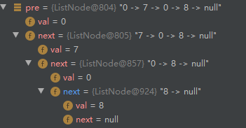

链表是一种特殊的数据结构：

它包含了两部分：
$$ListNodePtr
\begin{cases}{value} \\\\
{next}\begin{cases}{value} \\\\
                    {next}\begin{cases}{value} \\\\
                                       {next...}
                                       \end{cases}
                    \end{cases}
\end{cases}
$$
在《算法 第4版》中是这样描述的：
> 链表是一种递归的数据结构，它或者为空(null)，或者是指向一个结点(node)的引用，该结点含有一个泛型的元素和一个指向另一条链表的引用。

在我看来，因为链表是一种递归的数据结构，故不要把“结点”看成一个“点”。而应该看成是一个`value` + 该`value`后的全部链表———它是全部链表的一部分。
关于这个`value`，它可能是任意数据类型。

一般来说链表类可以写成如下结构：
```Java
 public class ListNode {
     int val;
     ListNode next;
     ListNode(int x) { val = x; }
     }
```
为了在调试代码的时候直观地看到链表形如`7 -> 0 -> 8 -> null`，链表类可以写成如下结构：
```Java
class ListNode {
    int val;
    ListNode next;

    ListNode(int x) {
        val = x;
    }
    public ListNode(int[] nums) {
        if (nums == null || nums.length == 0) {
            throw new IllegalArgumentException("arr can not be empty");
        }
        val = nums[0];
        ListNode curr = this;
        for (int i = 1; i < nums.length; i++) {
            curr.next = new ListNode(nums[i]); //创建ListNode实例，调用前面的构造方法
            curr = curr.next;
        }
    }
    @Override
    public String toString() {
        StringBuilder s = new StringBuilder();
        ListNode cur = this;
        while (cur != null) {
            s.append(cur.val);
            s.append(" -> ");
            cur = cur.next;
        }
        s.append("null");
        return s.toString();
    }

}
```
在调试的时候，比如向`SolutionMe0x0`类的`testListNode`方法中传递链表`ListNode lx, ListNode ly`，我们可以：
```Java
public class Main {

    public static void main(String[] args) {
	// write your code here
        int[] test1 = {2, 4, 3};
        int[] test2 = {5, 6, 4};
        //int[] test1 = {6, 7, 8, 3, 2, 7};
        //int[] test2 = {9, 7, 6, 6};
        //int[] test1 = {2};
        //int[] test2 = {5};
        ListNode lx = new ListNode(test1);
        ListNode ly = new ListNode(test2);
        System.out.println(SolutionMe0x0.testListNode(lx));
    }
}
```