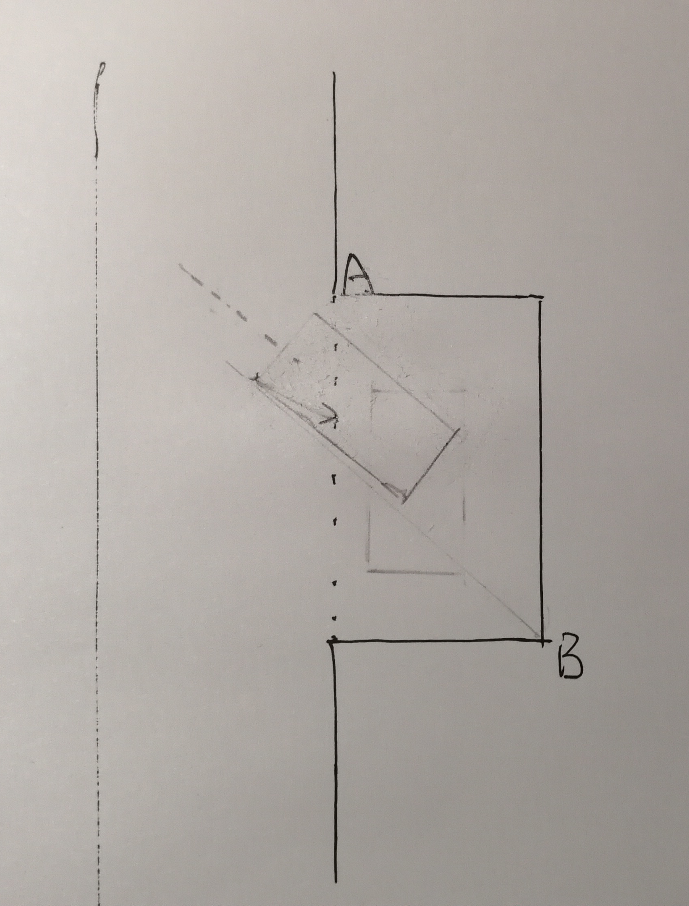

## 科目二
> 项目开始前准备：
> 系好安全带，放下手刹，踩下刹车，启动引擎，踩下离合器。
___
### 倒车入库

__左倒库：__ 
+ step 1: 挂1挡，轻踩离合至左后视镜看到L1角，方向盘向左打满。
+ step 2: 车身垂直于A线方向盘回正。
+ step 3: 行驶至胳膊超过A线离合刹车踩满停下，准备左倒车入库。
+ step 4: 挂倒挡，轻踩离合当车辆倒至左后视镜下边缘与A线重合，方向盘向左打满。
+ step 5: 此时注意左后视镜L1角，当L1角出现时，注意它和车身距离。大于30cm则车辆位置正确；小于则转角过大，方向盘向右回一圈减小转角。
+ step 6: 此时注意观察右后视镜，观察当R2角出现时，方向盘迅速回正，此时注意到车身和R线平行。
+ step 7: 继续倒车直至左后视镜下边缘与L1角重合。

__右倒库：__
+ step 1: 挂1挡，轻踩离合至左后视镜看到L1角，方向盘向右打满。
+ step 2: 车身垂直于B线方向盘回正。
+ step 3: 行驶至胳膊超过B线离合刹车踩满停下，准备右倒车入库。
+ step 4: 挂倒挡，轻踩离合当车辆倒至左后视镜下边缘与B线重合，方向盘向右打满。
+ step 5: 此时注意观察右后视镜R1角，当R1角出现时，注意它和车身距离。大于30cm则车辆位置正确；小于则转角过大，方向盘向左回一圈减小转角。
+ step 6: 此时注意左后视镜，观察当L2角出现时，方向盘迅速回正，此时注意到车身和L线平行。
+ step 7: 继续倒车直至左后视镜下边缘与L1角重合。

### 侧方位停车

__将车开出车库至准备区域：__
+ step 1: 挂1挡，踩离合，打左转向灯，方向盘向左打满。
+ step 2：注意观察左后视镜，当B角出现时，回正方向盘。
+ step 3：让车辆继续缓缓行驶，注意观察左后视镜，当左前门门把手与车库虚线重合时，方向盘向右打满。
+ step 4：观察右后视镜，当车右侧与虚线平行时，车身已正，方向盘回正。
+ step 5：观察右后视镜，当A角出现时，停车。

__右侧方停车：__
+ step 1：挂倒挡，观察右后视镜，当A直角消失，方向盘又打满。
+ step 2：注意观察左后视镜，当B直角出现，方向盘回正。
+ step 3：注意观察左后视镜，当左后轮即将碰到车库虚线时，方向盘左打满。
+ step 4：注意观察右后视镜，当车右侧与车库边线平行时，车身已正。停车。

